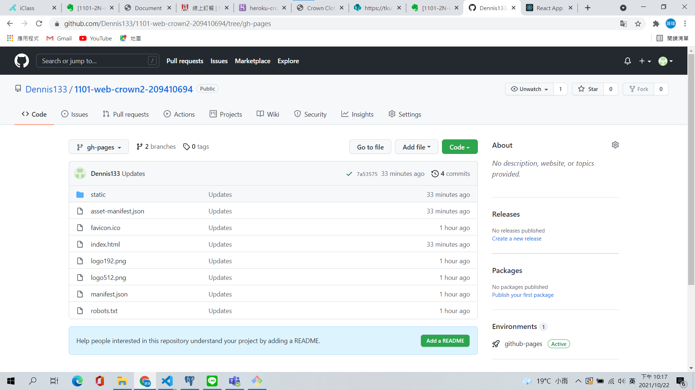
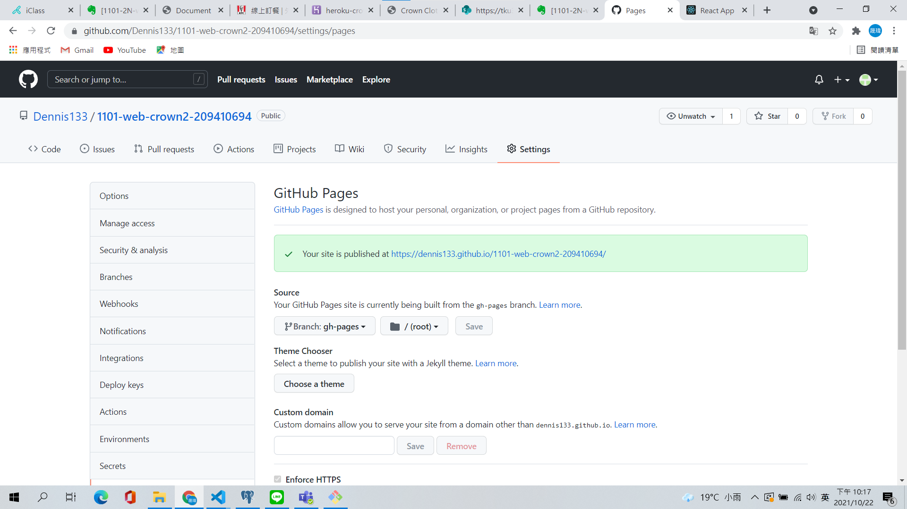
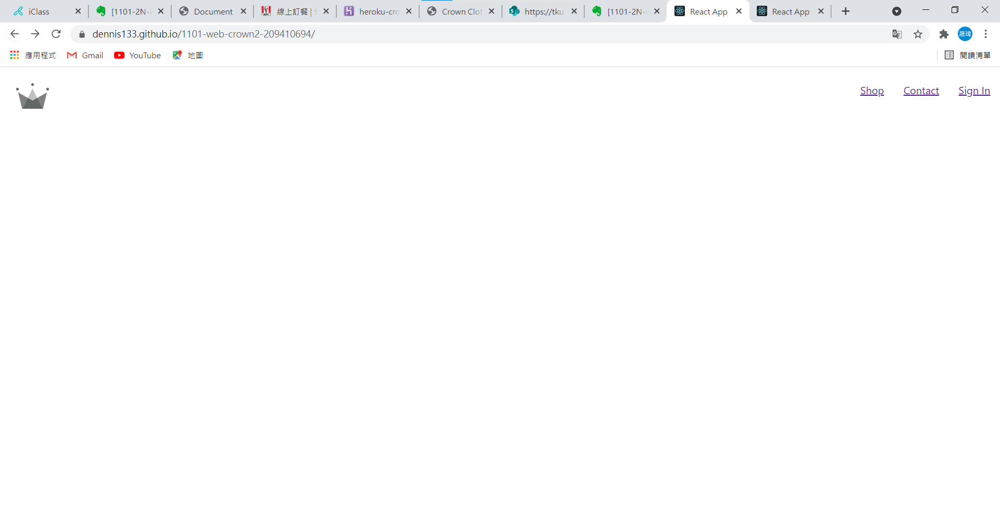
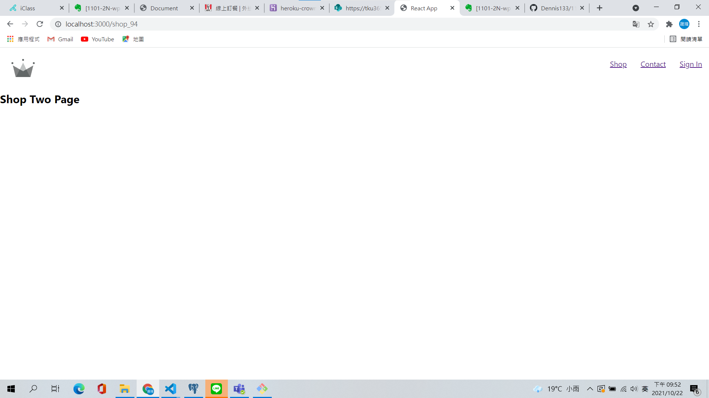
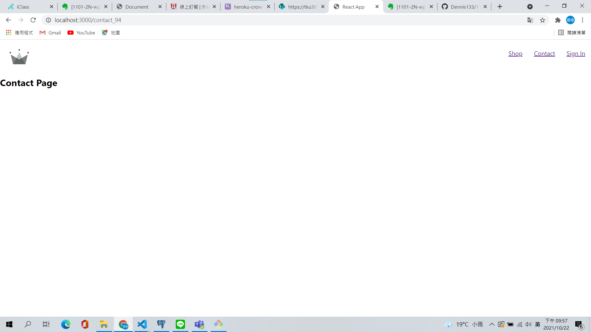
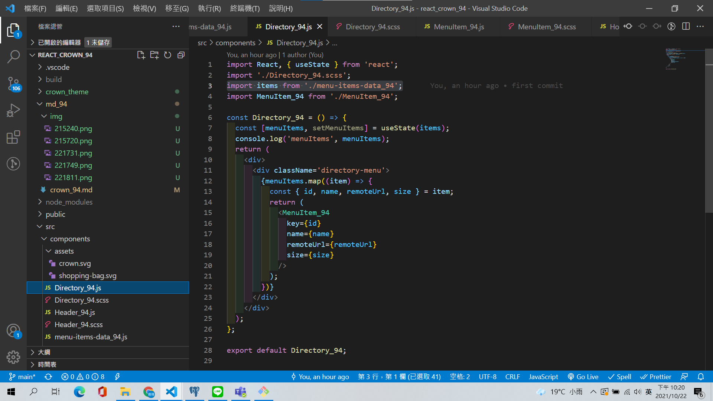
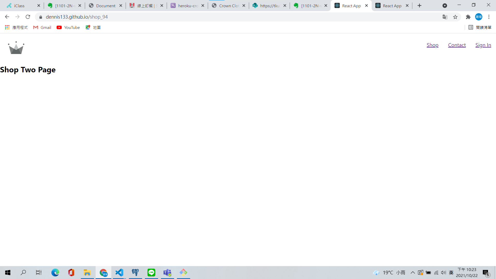

# W5 Web-crown209410694

1.  (local) 請以 App_xx.js 顯示下圖片，繳交

- Chrome 截圖
- 目錄結構及 App_xx 部分內容截圖 (以學號後 2 碼來展開 category 內容，其他收起)
- App_xx.js code (程式碼，非圖片 )

Chrome 截圖


目錄結構及 App_xx 部分內容截圖 (以學號後 2 碼來展開 category 內容，其他收起)


App_xx.js code (程式碼，非圖片 )

```
import './App_94.scss';

function App_94() {
  return (
    <div className='homepage'>
      <div className='directory-menu'>
        <div className='menu-item'>
          
          <a href='./hats.html' className='content'>
            <h1 className='title'>HATS</h1>
            <span className='subtitle'>SHOP NOW</span>
          </a>
        </div>
        <div className='menu-item'>
          
          <a href='./jackets.html' className='content'>
            <h1 className='title'>JACKETS</h1>
            <span className='subtitle'>SHOP NOW</span>
          </a>
        </div>
        <div className='menu-item'>
          
          <a href='./sneakers.html' className='content'>
            <h1 className='title'>SNEAKERS</h1>
            <span className='subtitle'>SHOP NOW</span>
          </a>
        </div>
        <div className='large menu-item'>
          
          <a href='./womens.html' className='content'>
            <h1 className='title'>WOMENS</h1>
            <span className='subtitle'>SHOP NOW</span>
          </a>
        </div>
        <div className='large menu-item'>
          
          <a href='./mens.html' className='content'>
            <h1 className='title'>MENS</h1>
            <span className='subtitle'>SHOP NOW</span>
          </a>
        </div>
      </div>
    </div>
  );
}

export default App_94;
```

---

2.  (local) 將 homepage 分成如下圖的 components，Homepage_xx.js, Direcory_xx.js, MenuItem_xx.js，並且能夠正常顯示如第 1 題。繳交

- Chrome 截圖
- 目錄結構，要含所有用到的 components
- Homepage_xx.js code (程式碼，非圖片 )
- Directory_xx.js code
- MenuItem_xx.js code

Chrome 截圖


目錄結構，要含所有用到的 components


Homepage_xx.js code (程式碼，非圖片 )

```
import React from 'react';

import Directory_94 from '../components/Directory_94';

const Homepage_94 = () => {
  return (
    <div className='homepage'>
      <Directory_94 />
    </div>
  );
};

export default Homepage_94;
```

Directory_xx.js code

```
import React from 'react';
import './Directory_94.scss';
import MenuItem_94 from './MenuItem_94';

const Directory_94 = () => {
  return (
    <div>
      <div className='directory-menu'>
        <MenuItem_94
          name='HATS'
          remoteUrl='https://i.ibb.co/cvpntL1/hats.png'
          size=''
        />
        <MenuItem_94
          name='JACKETS'
          remoteUrl='https://i.ibb.co/px2tCc3/jackets.png'
          size=''
        />
        <MenuItem_94
          name='SNEAKERS'
          remoteUrl='https://i.ibb.co/0jqHpnp/sneakers.png'
          size=''
        />
        <MenuItem_94
          name='WOMENS'
          remoteUrl='https://i.ibb.co/GCCdy8t/womens.png'
          size='large'
        />
        <MenuItem_94
          name='MENS'
          remoteUrl='https://i.ibb.co/R70vBrQ/men.png'
          size='large'
        />
      </div>
    </div>
  );
};

export default Directory_94;
```

MenuItem_xx.js code

```
import React from 'react';
import './MenuItem_94.scss';

const MenuItem_94 = ({ name, remoteUrl, size }) => {
  return (
    <div className={`${size} menu-item`}>
      
      <a href='./hats.html' className='content'>
        <h1 className='title'>{name}</h1>
        <span className='subtitle'>SHOP NOW</span>
      </a>
    </div>
  );
};

export default MenuItem_94;
```

---

3. (local) 將 menu items 五筆資料放入 JSON 陣列中，並能正常顯示如第 1 題。繳交
   Chrome 截圖
   JSON 陣列 (程式碼，非圖片 )
   Directory_xx.js code (程式碼，非圖片 )

Chrome 截圖


JSON 陣列 (程式碼，非圖片 )

```
const items = [
  {
    id: 1,
    name: 'HATS',
    remoteUrl: 'https://i.ibb.co/cvpntL1/hats.png',
    size: '',
  },
  {
    id: 2,
    name: 'JACKETS',
    remoteUrl: 'https://i.ibb.co/px2tCc3/jackets.png',
    size: '',
  },
  {
    id: 3,
    name: 'SNEAKERS',
    remoteUrl: 'https://i.ibb.co/0jqHpnp/sneakers.png',
    size: '',
  },
  {
    id: 4,
    name: 'WOMENS',
    remoteUrl: 'https://i.ibb.co/GCCdy8t/womens.png',
    size: 'large',
  },
  {
    id: 5,
    name: 'MENS',
    remoteUrl: 'https://i.ibb.co/R70vBrQ/men.png',
    size: 'large',
  },
];

export default items;
```

Directory_xx.js code (程式碼，非圖片 )

```
import React, { useState } from 'react';
import './Directory_94.scss';
import items from './menu-items-data_94';
import MenuItem_94 from './MenuItem_94';

const Directory_94 = () => {
  const [menuItems, setMenuItems] = useState(items);
  console.log('menuItems', menuItems);
  return (
    <div>
      <div className='directory-menu'>
        {menuItems.map((item) => {
          const { id, name, remoteUrl, size } = item;
          return (
            <MenuItem_94
              key={id}
              name={name}
              remoteUrl={remoteUrl}
              size={size}
            />
          );
        })}
      </div>
    </div>
  );
};

export default Directory_94;
```

---

4. (local, github) 實作路由 /shop_xx，可以顯示 overview.html 內兩種 category 的資訊 (c1, c2)，每一 category 要顯示 4 筆資料。c1, c2 由學號後兩碼來決定，顯示順序先 c1 再 c2，說明如下：
   1, 6 -- hats
   2, 7 -- jackets
   3, 8 -- sneakers
   4, 9 -- womens
   5, 0 -- mens
   如果 c1 = c2 兩個相同，那 c2 就取下一個。要繳交
   說明 c1, c2 那是坐那兩個

- local 端 Chrome 執行結果截圖
- Github page 執行結果截圖
  重要相關的原始程式碼

---

5. 將目前所完成的 React code 放入 Github 中，建立的 repository 要顯示 id 資訊。要繳交

- repository URL 及截圖，可以看到你的原始程式碼，
- Github page 設定之截圖
- Github page URL 及截圖，可以執行 React 程式
  以上截圖，都必須有網址列，如 HW1，上面會顯示 github page 的資訊。

repository URL 及截圖，可以看到你的原始程式碼，

Github page 設定之截圖

Github page URL 及截圖，可以執行 React 程式
以上截圖，都必須有網址列，如 HW1，上面會顯示 github page 的資訊。


---

6. (local) 加入 header，能顯示 logo 及選單，
   -- 點選 logo，會回到主頁 (路由 /)
   -- 點選 Shop，會到 Shop Overview Page (路由 /shop_xx)，要能顯示上面第 4 題的內容
   -- 點選 Contact，會到 Contact Page (路由 /contact_xx)
   -- 點選 Contact，會到 Signin Page (路由 /signin_xx)，要繳交

- local 端 Chrome /shop_xx 執行結果截圖
- local 端 Chrome /contact 執行結果截圖
- 跟路由 /shop_xx 有關的原始程式碼

local 端 Chrome /shop_xx 執行結果截圖

local 端 Chrome /contact 執行結果截圖

跟路由 /shop_xx 有關的原始程式碼

```
import React from 'react';

const ShopTwoPage_94 = () => {
  return <h2>Shop Two Page</h2>;
};

export default ShopTwoPage_94;
```

---

7. (heroku) 在 Heroku 上要能顯示第 6 題的 header。要繳交

- Heroku 上 Chrome /shop_xx 執行結果截圖

---

8. (local) 首頁 category 五筆資料，能夠透過你個人放在 Heroku /api_xx/category_xx 取得。如果無法成功，可以先用老師的測試。

https://crown1101.herokuapp.com/api_xx/category_xx

要繳交

- local 執行結果
- Directory2_xx 相關程式截圖
- Heroku app URL
- Heroku Database URL

local 執行結果


Directory2_xx 相關程式截圖


---

9. (Github page) 上第 8 題，請將程式碼發佈到 github page，並能直接從 Github page 執行，自 Heroku /api_xx/category_xx 取得 category 五筆資料，要繳交

- Github repo URL
- Github page URL
- Chrome 圖片有關 Github page 執行路由 / 結果
- Chrome 圖片有關 Github page 執行路由 /shop_xx 結果

Github repo URL
[https://github.com/Dennis133/1101-web-crown2-209410694](https://github.com/Dennis133/1101-web-crown2-209410694)

Github page URL
[https://github.com/Dennis133/1101-web-crown2-209410694/settings/pages](https://github.com/Dennis133/1101-web-crown2-209410694/settings/pages)

Chrome 圖片有關 Github page 執行路由 / 結果

Chrome 圖片有關 Github page 執行路由 /shop_xx 結果

